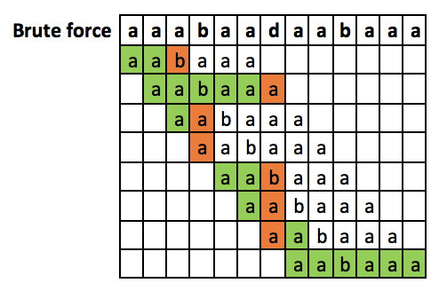
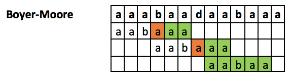
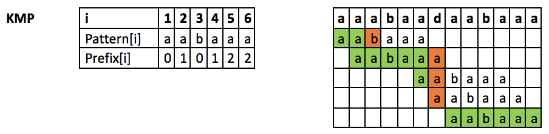
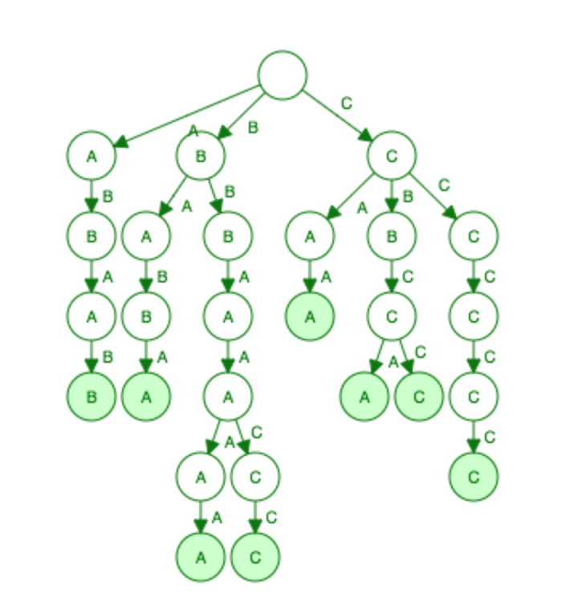
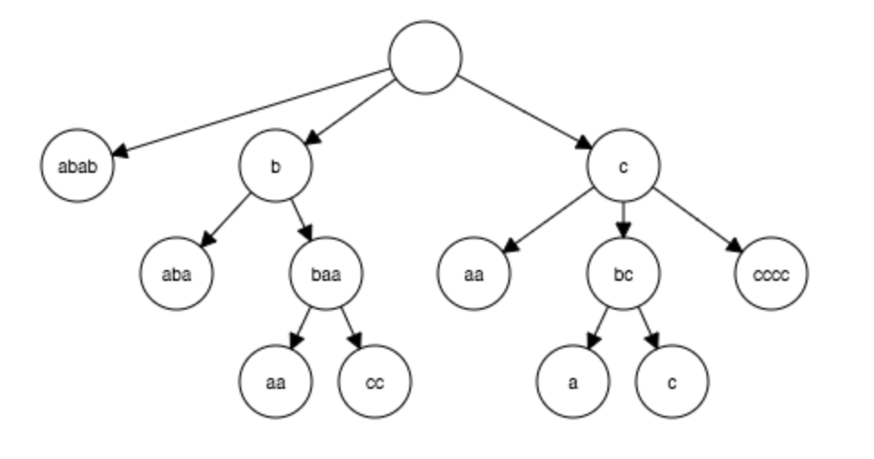
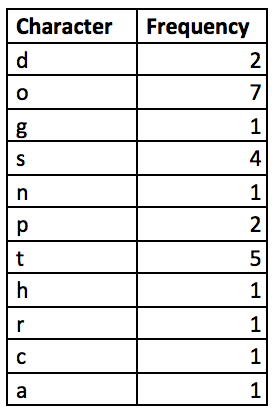
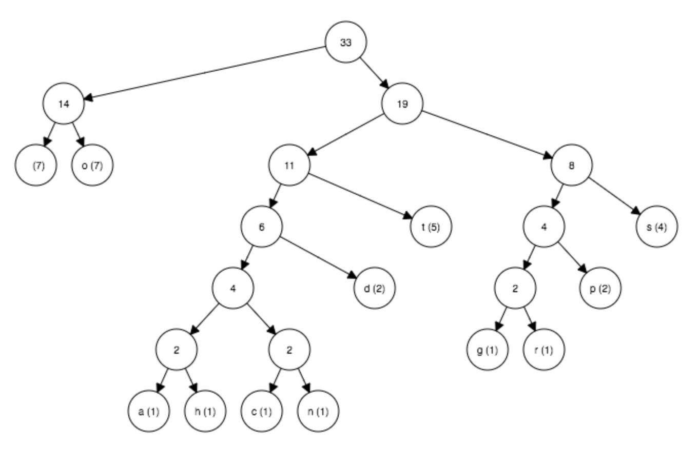
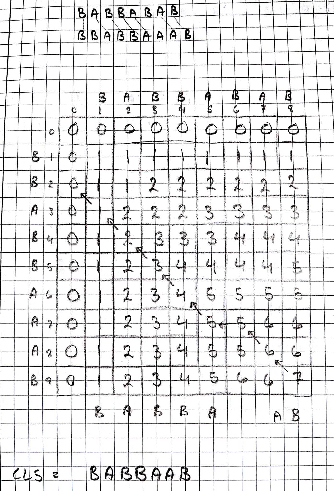

# Assignment 1 - Oblig
## Problem 1
Brute force algorithm on the text `aaabaadaabaaa` with the search string `aabaaa`

## Problem 2
Boyer-Moore algorithm on the text `aaabaadaabaaa` with the search string `aabaaa`

## Problem 3
Knut-Morris-Pratt algorithm on the text `aaabaadaabaaa` with the search string `aabaaa`

## Problem 4
There are 3 sets of prefixes that are also suffixes of `P = "aaabbaa" ` <br/>
`{a} {aa} {aaa}`

## Problem 5
Standard trie for the following set of strings: `{abab, baba, ccccc, bbaaaa, caa, bbaacc, cbcc, cbca}`

## Problem 6
Compressed trie for the following set of strings: `{abab, baba, ccccc, bbaaaa, caa, bbaacc, cbcc, cbca}`

## Problem 7
String to analyze: `dogs do not spot hot pots or cats`
### Frequency table


### Huffman tree

## Problem 9
 <br/>
As you can see here we get the longest common subsequence `babbaab`
## Problem 10
This problem has been solved using "kotlin" as programming language
### a) Recursive version
```kotlin
fun lcs(a: String, b: String): String {

    val bLen = b.length - 1
    val aLen = a.length - 1
    return when {
        a.isEmpty() || b.isEmpty() -> ""
        a[aLen] == b[bLen] -> lcs(a.substring(0, aLen), b.substring(0, bLen)) + a[aLen]
        else -> {
            val x = lcs(a, b.substring(0, bLen))
            val y = lcs(a.substring(0, aLen), b)
            if (x.length > y.length) x else y
        }
    }
}
```
### b) Dynamic version
```kotlin
fun lcsDynamic(a: String, b: String): String {
    val lengths = Array(a.length + 1) { IntArray(b.length + 1) }

    // row 0 and column 0 are initialized to 0 already

    for (i in 0 until a.length)
        for (j in 0 until b.length)
            if (a[i] == b[j])
                lengths[i + 1][j + 1] = lengths[i][j] + 1
            else
                lengths[i + 1][j + 1] = Math.max(lengths[i + 1][j], lengths[i][j + 1])

    // read the substring out from the matrix
    val sb = StringBuffer()
    var x = a.length
    var y = b.length
    while (x != 0 && y != 0) {
        when {
            lengths[x][y] == lengths[x - 1][y] -> x--
            lengths[x][y] == lengths[x][y - 1] -> y--
            else -> {
                assert(a[x - 1] == b[y - 1])
                sb.append(a[x - 1])
                x--
                y--
            }
        }
    }
    return sb.reverse().toString()
}
```
### c) Main to test the program
```kotlin
fun main(args: Array<String>) {
    val a = "aabbaaaaabaaaabaadaaacaacccaadaabbaaabcccdddaasa"
    val b = "aabbaaab"


    println(measureTimeMillis {
        lcs(a, b)
    })
    println(measureTimeMillis {
        lcsDynamic(a, b)
    })
}
```

Recursive version uses 24ms <br/>
Dynamic version uses 4ms